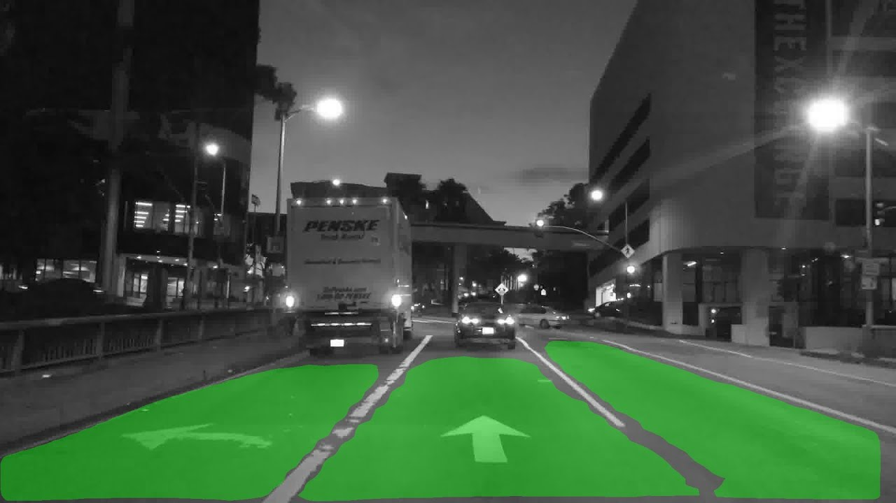

# Drivable-Area_Segmentation-with-BDD100K
Drivable Area Segmentation using Deep Learning and BDD100k dataset

Model inferred on an hour long driving video can be seen [here](https://youtu.be/ba0ytXOgvkM)

Update coming soon!
